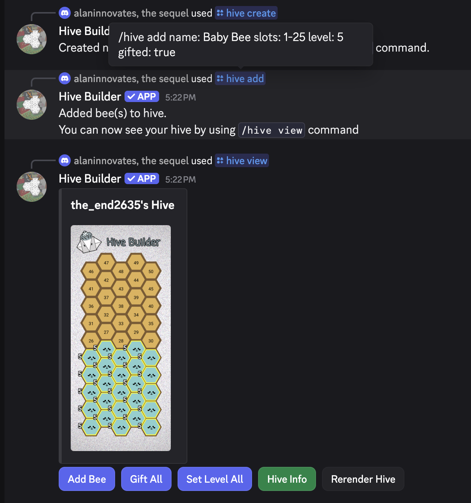
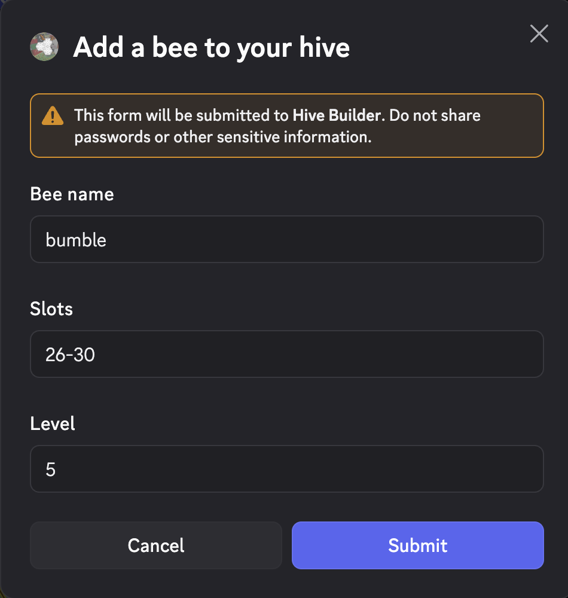
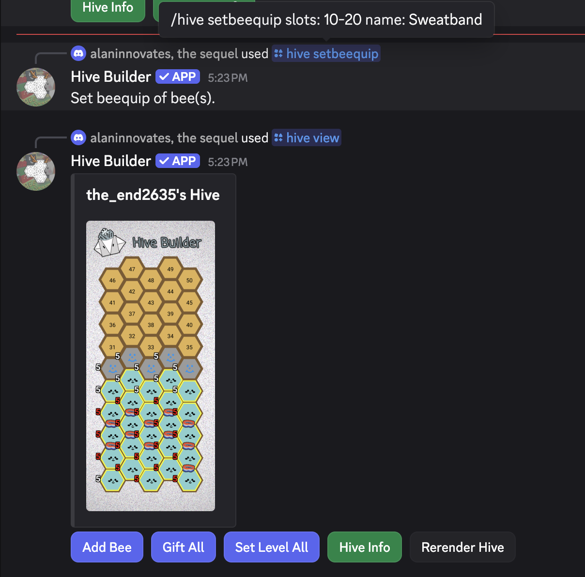
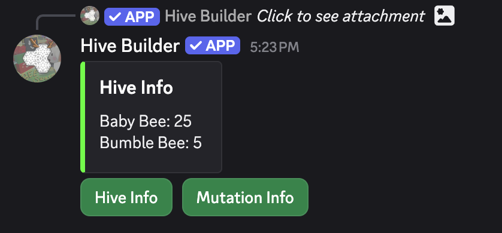
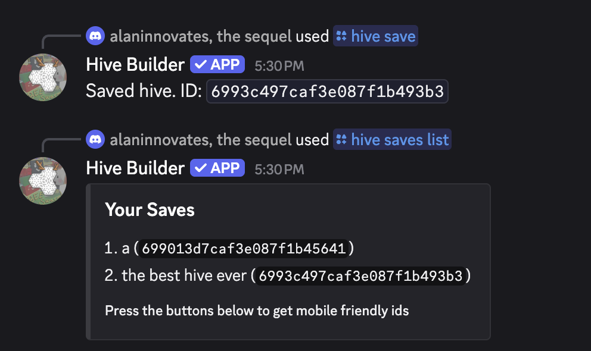
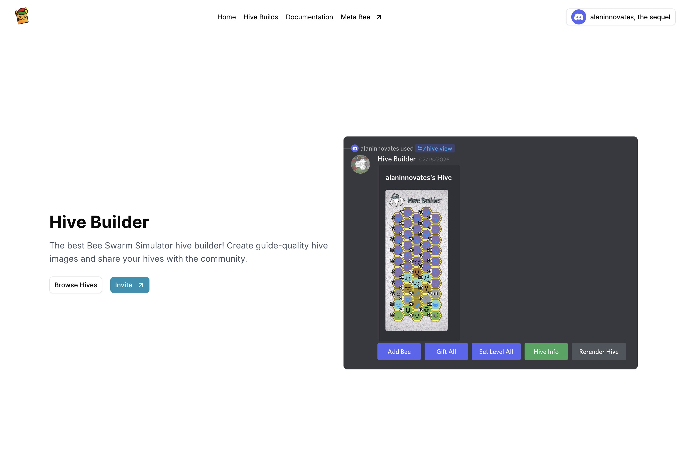
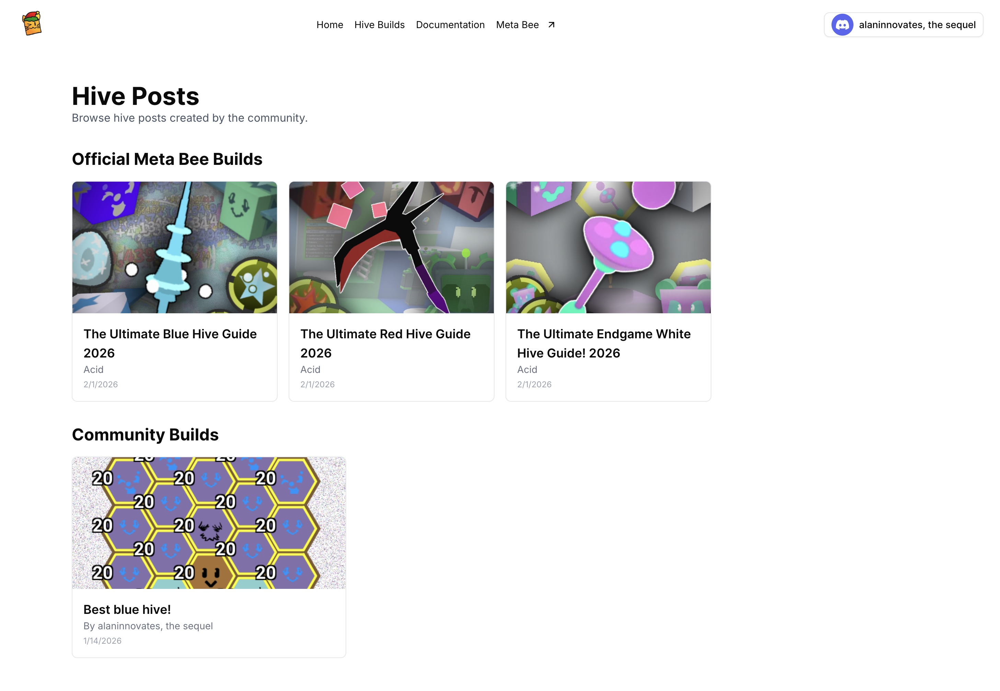
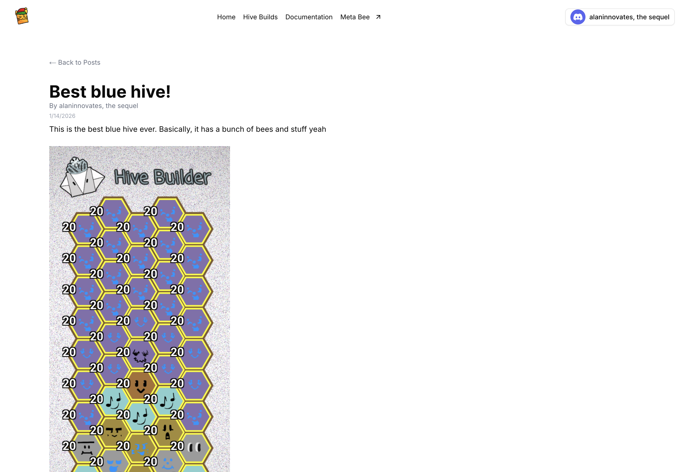
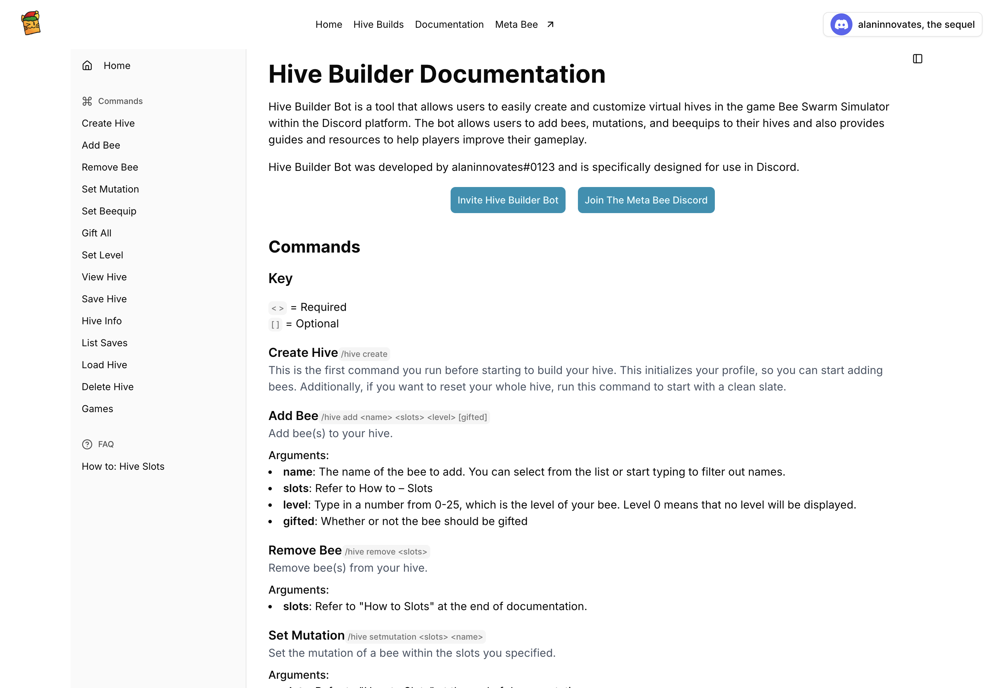

# Hive Builder Bot

Hive Builder Bot is a Discord bot that allows users to easily create and customize virtual hives in the game Bee Swarm Simulator within the Discord platform. The bot allows users to add bees, mutations, and beequips to their hives and also provides guides and resources to help players improve their gameplay.

Hive Builder Bot is a Meta Bee Project, developed by alaninnovates and is specifically designed for use in Discord, as the next generation of hive building from previous Meta Bee apps.

> [!NOTE]
> Add Hive Builder to your Discord with the link at online at [https://meta-bee.com/hive-builder](https://meta-bee.com/hive-builder) and visit the hive-sharing website at [https://hives.meta-bee.com](https://hives.meta-bee.com)

## Features
- Create beautiful hives suitable for guides, blogs, and general sharing
- Add all bees in the game
- Set mutations, beequips, gifting, and levels for each bee
- Split hive slots (i.e. two bees in one slot) to provide different options
- Web sharing

All guides seen on https://meta-bee.com are built using this bot!

## Commands
`/hive create`
- This is the first command you run before starting to build your hive. This initializes your profile, so you can start adding bees. Additionally, if you want to reset your whole hive, run this command to start with a clean slate.

`/hive add <name> <slots> <level> [gifted]`
- Add bee(s) to your hive.
- Arguments:
  - name: The name of the bee to add. You can select from the list or start typing to filter out names. 
  - slots: Refer to How to – Slots 
  - level: Type in a number from 0-25, which is the level of your bee. Level 0 means that no level will be displayed. 
  - gifted: Whether or not the bee should be gifted

`/hive remove <slots>`
- Remove bee(s) from your hive.
- Arguments:
  - slots: Refer to “How to Slots” at the end of documentation.

`/hive setmutation <slots> <name>`
`/hive setbeequip <slots> <name>`
- Set the beequip or mutation of a bee within the slots you specified.

`/hive giftall`
`/hive setlevel <level>`
- Set the level or gift ALL of the bees in your hive. Note: This is irreversible.

`/hive view [show_hive_numbers] [slots_on_top]`
- View your hive.
- Arguments:
  - show_hive_numbers: Show the numbers on each hive slot. These numbers are to help you figure out what slot you want to add a bee to, but you might not want them when showing the hive to others. Set this to False to disable the numbers. 
  - slots_on_top: When show_hive_numbers is enabled, this parameter allows you to draw hive numbers above the faces of any bee in your hive. This allows you to easily replace a bee, even if your hive is full!

`/hive save <name>`
- Save your hive, so you can always load it up again. If you want to overwrite a previous save, just use the same name as the old save.
- Be sure to ALWAYS SAVE YOUR HIVE! This way, you won’t lose any data.
- Arguments:
  - name: The name of your save

`/hive info`
- Get a summary of your hive and its contents.

`/hive saves list`
- List all of your hives.

`/hive saves load <id>`
- Load a previously saved hive.
- Note: THIS WILL OVERWRITE YOUR CURRENT HIVE! If you have data in your current working hive that you want to save, be sure to save it first!
- Arguments:
  - id: The ID of the saved hive. You can obtain this from the /hive saves list command.

`/hive saves delete <id>`
- Delete a previously saved hive.
- Note: THIS IS IRREVERSIBLE!
- Arguments:
  - id: The ID of the saved hive. You can obtain this from the /hive saves list command.

`/game <game>`
- All the subcommands within this command are games that you can play for fun.

## Screenshots
Discord Bot
<table>
    <tr>
        <td>
            Add bees and view your hive 
            
        </td>
        <td>
            Add bees by modal 
            
        </td>
    </tr>
    <tr>
        <td>
            Add beequips and mutations 
            
        </td>
        <td>
            View your hive information 
            
        </td>
    </tr>
    <tr>
        <td>
            Save your hive for later editing 
            
        </td>
    </tr>
</table>

Website
<table>
    <tr>
        <td>
            Home page 
            
        </td>
        <td>
            Hive posts and builds 
            
        </td>
    </tr>
    <tr>
        <td>
            View a build 
            
        </td>
        <td>
            Bot documentation 
            
        </td>
    </tr>
</table>
